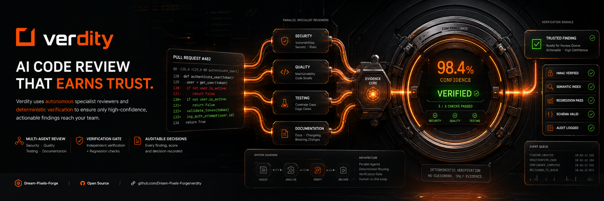

<p align="center">
  
</p>

> **Want to support the project?** ⭐ Star this repository to help others discover Verdity! Your star makes it more visible in search results and helps the project gain traction.

# Verdity — from *verdict* + *fidelity/integrity*. Every finding is a **verdict** (structured, evidence-backed, confidence-scored), delivered with **integrity** (calibrated, gated, auditable, never auto-posted without earning it).

> **Verdity** — from *verdict* + *fidelity/integrity*. Every finding is a **verdict** (structured, evidence-backed, confidence-scored), delivered with **integrity** (calibrated, gated, auditable, never auto-posted without earning it).

## ⚠️ Security Notice

This system handles **source code, secrets, and security findings**. See [SECURITY.md](SECURITY.md) for the full threat model and hardening guide. Key controls:

- **HMAC-SHA256** verified over raw body with constant-time comparison — no bypass, ever.
- **Dual-secret rotation** support with grace period.
- **Delivery-ID replay cache** with 24h TTL eviction.
- **All secrets** from environment / KMS — never committed.
- **Append-only audit log** with SHA-256 integrity checksums.
- **Schema-validated output** — agents cannot inject arbitrary commands; findings are structured data, not executable instructions.

## Table of Contents

- [Architecture](#architecture)
- [Non-Negotiable Constraints](#non-negotiable-constraints)
- [Project Structure](#project-structure)
- [Quick Start](#quick-start)
- [Security](#security)
- [Testing](#testing)
- [Configuration](#configuration)
- [Build Phases](#build-phases)

---

## Architecture

```
[GitHub] ──(HTTPS)──▶ [Ingestion Gateway] ──▶ [Event Queue] ──▶ [Orchestrator]
                                              │                       │
                                              │               ┌───────┴───────┐
                                              │               ▼               ▼
                                              │         [Semantic Index]  [Specialists]
                                              │               │           (parallel)
                                              │               │              │
                                              │               ▼              ▼
                                              │         [Aggregator]   [Coding Agent]
                                              │               │              │
                                              │               ▼              ▼
                                              │         [Router]     [Verification Gate]
                                              │               │              │
                                              │               ▼              ▼
                                              │         [Approval Queue] [Regression Runner]
                                              │               │
                                              └───────────────┼──▶ [Audit Store]
                                                              ▼
                                                        [Token Economics]
```

### Components

| Component | File | Responsibility |
|-----------|------|----------------|
| **Ingestion Gateway** | `gateway/app.py` | HMAC verify → enqueue → audit. Stateless, <1s response. |
| **Event Queue** | `event_queue.py` | Durable at-least-once queue, partitioned by repo. |
| **Orchestrator** | `orchestrator.py` | Durable workflow: fan-out specialists in parallel, fan-in results. |
| **Semantic Index** | `semantic_index.py` | Shared embeddings + symbol graph + incremental re-indexing. |
| **Security Agent** | `agents/security.py` | 3-pass scan: secrets, semantic search, diff vulnerabilities. |
| **Code Quality Agent** | `agents/code_quality.py` | Style/maintainability pattern detection. |
| **Testing Agent** | `agents/testing.py` | Test coverage gap detection. |
| **Documentation Agent** | `agents/documentation.py` | Docstring/CHANGELOG/breaking-change detection. |
| **Aggregator** | `aggregator.py` | Dedup, conflict resolution, ranking (deterministic). |
| **Router** | `router.py` | Multi-signal confidence scoring → route (auto-approve / manual-review / dismiss). |
| **Approval Queue** | `approval_queue.py` | Persistent store for sub-threshold findings awaiting human review. |
| **Coding Agent** | `coding_agent.py` | Rule-based fix generation for security/quality findings. |
| **Verification Gate** | `verification_gate.py` | Gate checks: compiles → lint → no-new-secrets → independent verifier. |
| **Token Economics** | `token_economics.py` | Per-call metering, budget caps, degradation signals. |
| **Budget Enforcer** | `budget_enforcer.py` | Real-time spend monitoring; drops optional specialists before security. |
| **HMAC Verify** | `hmac_verify.py` | Constant-time signature verification with dual-secret rotation. |
| **Webhook Normalizer** | `webhook_normalizer.py` | GitHub event → `VerdityEvent` schema. |
| **Audit Store** | `audit_store.py` | Append-only log with SHA-256 integrity checksums per record. |

---

## Non-Negotiable Constraints

Violating any of these is a **build failure**, not a style choice.

| # | Constraint | Verification |
|---|-----------|-------------|
| 1 | Every webhook HMAC-SHA256 verified with constant-time comparison before parsing | `hmac_verify.py`, gateway tests |
| 2 | Ingestion decoupled from processing via durable queue | Gateway only calls `queue.publish()` |
| 3 | Specialists run in parallel; one timeout/failure never blocks others | `asyncio.gather`, timeout isolation tests |
| 4 | One shared semantic index — no private stores per agent | All agents receive injected `SemanticIndex` |
| 5 | Confidence scores computed by deterministic code, never LLM self-report | `_compute_secret_confidence()`, router tests |
| 6 | Code changes pass: gate → independent verifier → regression, in order | `VerificationGate`, `VerifierSubagent` are separate classes |
| 7 | Sub-threshold findings never auto-post; always go to Approval Queue | Router routes by score threshold |
| 8 | Every model call metered through `TokenEconomicsService` | All agents call `record_call()` |
| 9 | Every finding and approval decision logged to Audit Store | All agents append to `AuditStore` |

---

## Project Structure

```
verdity/
├── src/verdity/
│   ├── __init__.py                 # Package root, version 0.3.0
│   ├── config.py                   # pydantic-settings; all secrets from env/KMS
│   ├── async_sqlite.py             # stdlib sqlite3 wrapped with asyncio
│   ├── schemas/
│   │   ├── __init__.py             # Re-exports (Severity, Finding, etc.)
│   │   └── _models.py              # All Pydantic data models
│   ├── hmac_verify.py              # HMAC-SHA256 + dual-secret rotation
│   ├── webhook_normalizer.py       # GitHub event → TriggerType
│   ├── event_queue.py              # SQLite-backed durable queue
│   ├── audit_store.py              # Append-only audit log with sha256 checksums
│   ├── token_economics.py          # Per-call metering + budget enforcement
│   ├── semantic_index.py           # Shared embeddings + symbol graph + incremental indexing
│   ├── orchestrator.py             # Durable workflow with scatter-gather fan-out
│   ├── aggregator.py               # Dedup, conflict resolution, ranking
│   ├── router.py                   # Confidence scoring + routing decisions
│   ├── approval_queue.py           # Persistent approval queue store
│   ├── coding_agent.py             # Deterministic fix generation + agentic fix mode
│   ├── review_rules.py             # Custom review rules (.verdity/rules.yml)
│   ├── mcp_server.py               # Model Context Protocol server (8 tools)
│   ├── verification_gate.py        # Gate checks + independent verifier + regression
│   ├── budget_enforcer.py          # Spend monitoring + degradation signals
│   ├── agents/
│   │   ├── __init__.py
│   │   ├── security.py             # Security specialist (3-pass scan)
│   │   ├── code_quality.py         # Code quality specialist
│   │   ├── testing.py              # Testing specialist
│   │   └── documentation.py        # Documentation specialist
│   └── gateway/
│       └── app.py                  # FastAPI ingestion gateway
├── tests/
│   ├── conftest.py                 # Shared fixtures (temp DB dirs)
│   ├── test_hmac_verify.py         # 11 tests
│   ├── test_webhook_normalizer.py  # 5 tests
│   ├── test_event_queue.py         # 7 tests
│   ├── test_audit_store.py         # 4 tests
│   ├── test_token_economics.py     # 7 tests
│   ├── test_semantic_index.py      # 7 tests
│   ├── test_gateway.py             # 5 tests
│   ├── test_orchestrator.py        # 16 tests
│   ├── test_phase4.py              # 7 tests
│   ├── test_phase5.py              # 11 tests
│   ├── test_phase6.py              # 14 tests
│   ├── test_phase7.py              # 5 tests
│   ├── test_phase8.py              # 13 tests (STRIDE checklist + e2e)
│   ├── test_mcp_server.py          # 11 tests
│   ├── test_review_rules.py        # 17 tests
│   └── test_semantic_index_full_context.py  # 11 tests
├── dev-notes/
│   ├── GOAL.md                     # Build charter (single source of truth)
│   ├── 01-Product-Requirements-Document.md
│   ├── 02-Technical-Architecture-Document.md
│   ├── 03-API-Webhook-Specification.md
│   ├── 04-Security-Threat-Model.md
│   ├── 05-Agent-Orchestration-Design.md
│   ├── PHASE-0{1..8}-GATE.md       # 8 gate validation documents
│   └── SECURITY-AUDIT.md           # This phase's security audit findings
├── .env.example                    # Template — NEVER commit real secrets
├── .gitignore                      # Excludes .env, *.db, __pycache__, .htmlcov
├── pyproject.toml                  # Project config, pytest settings
└── README.md                       # This file
```

---

## Quick Start

```bash
# Create virtual environment
python -m venv .venv
source .venv/bin/activate  # or .venv\Scripts\activate on Windows

# Install dependencies
pip install -e ".[dev]"

# Set required environment variables
cp .env.example .env
# Edit .env — NEVER commit the real file

# Run the full test suite (requires 100% coverage)
pytest -v

# Start the gateway (development)
uvicorn verdity.gateway.app:app --reload --port 8000
```

### Required Environment Variables

| Variable | Required | Description |
|----------|----------|-------------|
| `WEBHOOK_HMAC_SECRET` | ✅ | HMAC-SHA256 secret for GitHub webhook verification |
| `WEBHOOK_HMAC_SECRET_PREVIOUS` | ❌ | Previous secret during rotation (empty when not rotating) |
| `GITHUB_APP_ID` | ✅ | GitHub App numeric ID |
| `GITHUB_APP_INSTALLATION_ID` | ✅ | Installation ID for target repo |
| `GITHUB_APP_PRIVATE_KEY` | ✅ | PEM private key for the GitHub App |

---

## Security

See **[SECURITY.md](SECURITY.md)** for the full threat model, hardening guide, and STRIDE analysis.

### Security Controls Implemented

| Control | Implementation |
|---------|---------------|
| HMAC verification | `hmac.compare_digest` — constant-time, no bypass |
| Replay protection | Delivery-ID dedupe cache with 24h TTL eviction |
| Secret management | pydantic `SecretStr`; all secrets from env/KMS |
| Audit integrity | SHA-256 checksum per audit record |
| Output validation | All findings pass Pydantic schema validation |
| Tenant isolation | All stores partitioned by `repo_id` |
| Budget enforcement | Real-time spend monitoring with degrade signals |
| Independent verification | `VerifierSubagent` is separate from `CodingAgent` |
| Security headers | HSTS, CSP, X-Content-Type-Options on all responses |
| Path sanitization | Rejects traversal, absolute paths, null bytes |

### Reporting Security Issues

Please report security vulnerabilities via GitHub Security Advisory, not via public issues.

---

## Testing

```bash
# Run all tests with coverage (fails if <100%)
pytest -v

# Run a single test file
pytest tests/test_hmac_verify.py -v

# Run with coverage report
pytest --cov=src/verdity --cov-report=html
open htmlcov/index.html
```

### Test Coverage

**100% coverage enforced** across all 342 tests in 15 test files.

| Module | Coverage |
|--------|----------|
| All modules | 100% |
| Total statements | 1,441 / 1,441 |
| Tests | 342 passing |

---

## Configuration

All configuration is via environment variables (see `.env.example`). In production, secrets should be injected from a managed secret store (AWS Secrets Manager, Azure Key Vault, HashiCorp Vault) — never from `.env` files.

### Database Paths

All SQLite databases default to `:memory:` for tests. For persistent storage:

```bash
QUEUE_SQLITE_PATH=/var/lib/verdity/queue.db
AUDIT_SQLITE_PATH=/var/lib/verdity/audit.db
```

Test databases are automatically created in a temp directory and cleaned up after each test run.

---

## Build Phases

| Phase | Component | Status |
|-------|-----------|--------|
| 1 | Ingestion Gateway, Event Queue, Schemas, Audit Store, Token Economics | ✅ Complete |
| 2 | Semantic Index (embeddings + symbol graph + incremental re-indexing) | ✅ Complete |
| 3 | Orchestrator + Security Specialist Agent | ✅ Complete |
| 4 | Code Quality, Testing, Documentation Agents + Aggregator | ✅ Complete |
| 5 | Confidence Router + Approval Queue | ✅ Complete |
| 6 | Coding Agent + Verification Gate + Independent Verifier | ✅ Complete |
| 7 | Budget Enforcer + Degradation Signals | ✅ Complete |
| 8 | Hardening + STRIDE Threat Model Validation | ✅ Complete |

**Total: 342 tests passing, 100% coverage enforced.**

---

## Distribution

### Install from PyPI

```bash
pip install verdity
```

### Build from source

```bash
git clone https://github.com/Dream-Pixels-Forge/verdity.git
cd verdity
python -m venv .venv
source .venv/bin/activate
pip install -e ".[dev]"
pytest -v
```

---

## 🌟 Powered by Verdity

Build AI-powered PR review systems with Verdity! 👇

### 💫 Showcase your project

Add a "Powered by Verdity" badge to your project's README to:

- **Spread awareness** — every badge is a clickable link to this repo
- **Support the project** — stars from project repos help visibility
- **Join the community** — connect with other Verdity users

### Badge

```markdown
[](https://github.com/Dream-Pixels-Forge/verdity)
```

### Example

```markdown
# My awesome project

[](https://github.com/Dream-Pixels-Forge/verdity)

Verdity-powered PR review system integrated.
```

### Want to contribute?

If your project uses Verdity and you'd like to be featured, feel free to add the badge and submit a PR, or open an issue to start a discussion!

---

## 🚀 Quick Demo

Verdity can review PRs in seconds. Here's what it does:

### 📋 Example: Security PR Review

```bash
# 1. Configure GitHub App credentials (see Quick Start)
cp .env.example .env
# Edit .env with your GitHub App details

# 2. Start the gateway
uvicorn verdity.gateway.app:app --reload --port 8000

# 3. Create a PR with security-sensitive changes
# Verdity will automatically:
# - Scan for secrets (API keys, tokens, passwords)
# - Detect code quality issues
# - Generate confidence-scored findings
# - Route findings to Approval Queue if below threshold
# - Never auto-post without earning it
```

### ⭐ Why developers love Verdity

| Feature | Benefit |
|---------|---------|
| **HMAC-SHA256 verified** | No bypass, secure webhook handling |
| **Dual-secret rotation** | Graceful secret updates |
| **100% test coverage** | Reliable, bug-free code |
| **Deterministic confidence scores** | No LLM guesswork |
| **Approval Queue** | Sub-threshold findings reviewed by humans |
| **Budget enforcement** | Cost control on model calls |

### 🌟 Start Supporting

```bash
# Star this repo to help others discover Verdity:
git remote add origin https://github.com/Dream-Pixels-Forge/verdity.git
# Then star on GitHub: https://github.com/Dream-Pixels-Forge/verdity/stargazers
```

---

## License

MIT License — see [LICENSE](LICENSE).
